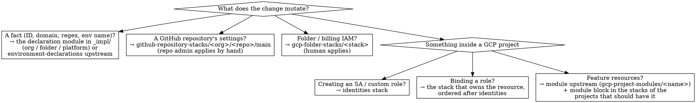

# Terraform the sdk-terraform way

## Overview

Infrastructure is **stacks keyed by the scope they mutate**, composed from a **shared
module library**, glued by a **generated pipeline**, and run by a **ladder of
identities** that never holds a key. Every environment difference is visible as a
difference in files, not in a variable value.

The canonical source of truth is `engineering11/sdk-terraform`:

| File | Read it when |
| --- | --- |
| `AGENTS.md` (= `CLAUDE.md`) | Before editing anything. Layout, module vs stackule, ordering rules, state rules |
| `tf/DOWNSTREAM.md` | Standing up or extending a downstream repo |
| `tf/pipeline/README.md` | Touching generated files, stack order, tunnels, adoption |
| a downstream's `tf/README.md` | Its control plane, actors, adopted objects, CI |

This skill is the portable summary and the decision procedure. When it and
`AGENTS.md` disagree, `AGENTS.md` at the pinned ref wins; tell the user so the skill
gets fixed (in `e11community/agent-skills`, by PR).

**Reference files in this skill** — read on demand:

- [reference/layout.md](reference/layout.md) — full tree, backends, bootstrap order, actors, CI
- [reference/authoring.md](reference/authoring.md) — module/stack style: files, ordering, IAM placement, tests
- [reference/porting.md](reference/porting.md) — converting a tfvars-per-environment repo into this regime

## The invariants

1. **A stack is keyed by its target scope, never by an environment name.**
   `tf/_impl/gcp-projects/<project-id>/gcp-project-stacks/<stack>/`,
   `tf/_impl/gcp-folders/<folder>/gcp-folder-stacks/<stack>/`,
   `tf/_impl/github-repositories/<org>/<repo>/github-repository-stacks/<stack>/`.
   Not every stack targets a GCP project. A repository's rulesets belong to the
   repository; a folder's grants to the folder. A new kind of target (a Cloudflare zone,
   a GitHub org) gets its own `<scope>-stacks/` keyed by that scope's natural ID.
2. **The GCP project ID is the key; the environment is a fact.** A project stack reads
   its environment from `module.this_environment` (an environment declaration). Nothing
   assumes environment ↔ project is 1:1: two projects may share an environment, and a
   project (the admin project) may have none.
3. **Environments differ by structure, not by toggles.** A module block is present in a
   stack's `main.tf` or it is absent. A stack directory exists in a project or it does
   not. **Never** `count = var.enable_x ? 1 : 0` to include or exclude a module or a
   feature per environment, and never an empty-string sentinel (`alert_email = ""`) that
   silently switches resources off. Values that legitimately vary (node count, machine
   type, disk size, hostnames) stay values in `terraform.tfvars`.
4. **Facts are declared once and read from outputs-only modules.** Organization,
   folder, platform, environment, and project identity come from declaration modules
   (`module.this_org`, `this_platform`, `this_environment`, `this_project`). Never
   re-declare them as stack variables or repeat them in `terraform.tfvars`.
5. **The control plane is separate and deliberately weaker.** Each platform has one
   folder and one admin project, `<platform>-admin-100`, holding the GitHub OIDC pool and
   the `bootstrap-admin` service account. Its grants live on the folder and are applied
   by a human, so `bootstrap-admin` can never widen its own reach. It has no data-plane
   roles, and `owner`/`editor` are refused.
6. **Identity ladder, no keys.** Human → `bootstrap-admin` (once per project:
   `services → identities → github`) → `github-actions@<project>` (everything else,
   forever). Federation only — no service-account JSON keys, no impersonation chains.
   Production is reachable only from production refs (`^refs/heads/production(-.+)?$`),
   enforced **in GCP** by the WIF attribute mapping, not by a workflow `if:`.
7. **Identities are created in one stack and bound in later ones.** `depends_on` does not
   wait for IAM propagation. Service accounts and custom roles live in `identities`;
   bindings live in the stacks after it. Stack boundaries follow apply-ordering and
   lifecycle (e.g. Cloud SQL is `postgresql` → `postgresql-access` → `postgresql-gcp-project`).
8. **State is mechanical.** Bucket `<project-id>-remote-state`, prefix
   `<scope>-stacks/<stack>`. `backend.tf` is **generated** (backends cannot
   interpolate); never hand-edit one in a project stack. `remote-state` keeps a local,
   gitignored backend **permanently**. Non-project stacks hand-write a backend in
   `<platform>-admin-100-remote-state`.
9. **State changes are code.** `import`, `moved`, `removed { lifecycle { destroy = false } }`
   go in the stack's `state.tf`, are reviewed in a PR, applied, then deleted (leave a
   dated comment). Never `tofu state mv|rm|import` on the CLI.
10. **Reference, never copy.** Downstream repos consume modules by
    `git::https://github.com/engineering11/sdk-terraform.git//tf/<path>?ref=vN` (moving
    major tag) and the pipeline through `tf/pipeline/run.sh` (wrapper reading
    `tf/sdk-terraform.ref`). Downstream `_impl/` holds only instantiation. New
    capability is a module **upstream**, proven in terralab's `_impl`, then released.
11. **OpenTofu only.** `tofu`, never `terraform`: a newer `terraform` binary rewrites the
    recorded version and `tofu` then refuses the state. The CI pin (`TOFU_VERSION`) must
    match what writes state. Lock files are committed with all four platforms' hashes.
12. **CI converges every stack.** PR → plan (non-prod), merge to `main` → apply non-prod
    in order, push to a production branch → apply prod, nightly → drift. Humans apply
    only: the control plane, each project's `remote-state`, and repository stacks
    (they need `administration: write`).

## Where does this change go?



Then ask: **which projects get it?** Add the module block (or stack directory) to
exactly those projects. Promotion to another project is a PR that copies the block —
the diff *is* the promotion.

Does it need a new stack, or a block in an existing stack? A new stack when it must
apply in a **separate invocation** (propagation, a tunnel, a provider that needs an
earlier stack's output, a different applier) or has a **different lifecycle/blast
radius** (stateful data vs. cheap-to-replace). Otherwise add to an existing stack. A
new stack name must also appear in the pipeline's `pipeline.conf` order (upstream) or
the pipeline will not run it.

## Stack anatomy (project stack)

```
tf/_impl/gcp-projects/<project-id>/
├── gcp-project.auto.tfvars        GENERATED: environment, platform, project_id, project_number
└── gcp-project-stacks/<stack>/
    ├── backend.tf                 GENERATED from the pipeline template — do not edit
    ├── gcp-project.auto.tfvars    SYMLINK → ../../gcp-project.auto.tfvars
    ├── data.tf                    data sources incl. terraform_remote_state of earlier stacks
    ├── main.tf                    "# ── Bootstrap ──" (this_org/platform/environment/project), then module blocks
    ├── outputs.tf                 every output
    ├── providers.tf               provider configuration
    ├── state.tf                   import / moved / removed only (when present)
    ├── terraform.tfvars           this stack's own values — no facts, no secrets
    ├── variables.tf               every variable + locals (common_labels)
    ├── versions.tf                required_version + required_providers
    └── .terraform.lock.hcl        committed, multi-platform hashes
```

Cross-stack values: `terraform_remote_state` within a project (literal bucket/prefix in
`data.tf`); declaration modules for anything above the project. **Never hard-code
another stack's output** — an instance connection name, a service-account email, a
project number — in `terraform.tfvars`.

## Commands

```bash
tf/pipeline/run.sh <project-id>                       # dry run: gen + plan every stack in order
tf/pipeline/run.sh <project-id> --check               # CI gate: generated files match templates
tf/pipeline/run.sh <project-id> --apply --only <stack>
tf/pipeline/run.sh <project-id> --from <stack> --to <stack>
PIPELINE_TOOL=steps/adopt-remote-state.sh tf/pipeline/run.sh <project-id> status|auto
PIPELINE_TOOL=steps/pg-tunnel.sh         tf/pipeline/run.sh open|close <project-id>

S=tf/_impl/gcp-projects/<project-id>/gcp-project-stacks/<stack>
tofu -chdir=$S init && tofu -chdir=$S plan -out .tfplan && tofu -chdir=$S apply .tfplan

tofu fmt -check -recursive tf
tofu -chdir=<module-dir> init -backend=false && tofu -chdir=<module-dir> test
tofu providers lock -platform=linux_amd64 -platform=linux_arm64 -platform=darwin_amd64 -platform=darwin_arm64
```

Read every plan's action counts. For anything holding data: `0 to destroy` and no
`must be replaced`. Never pipe `apply` into `tail`/`head` — you get the pager's exit
code. `tofu init -upgrade` locally to pick up a moved major tag; CI starts clean.

## Red flags — stop and fix

| You see / are about to write | Instead |
| --- | --- |
| `count = var.enable_x ? 1 : 0` around a module or feature | Add or omit the module block per project |
| `x = ""` default that disables resources when empty | Require the value, or leave the module out of that project |
| `environments/<env>.tfvars` + `-backend-config` | One stack directory per project; generated `backend.tf` |
| `variable "gcp_project"` set per env in tfvars | `var.project_id` from the generated `gcp-project.auto.tfvars` |
| Hard-coded `123456789-compute@developer…` or another stack's resource name | `terraform_remote_state`, a data source, or an `identities` output |
| A stack that creates an SA **and** other stacks bind it | SA in `identities`; bindings in later stacks |
| `credentials_json: secrets.GCP_SA_KEY` | WIF: `vars.GCP_WIF_PROVIDER` + `github-actions@<project>` |
| A workflow `if:` as the only gate on prod | Production-ref-only federation in GCP |
| A copied upstream module / pipeline script in a downstream repo | Git source at `?ref=vN`; wrapper `run.sh` |
| `terraform` binary, or a lock file from `registry.terraform.io` | `tofu`; re-lock against `registry.opentofu.org` |
| `tofu state rm/mv/import` on the CLI | A block in `state.tf` |
| Hand-editing a project stack's `backend.tf` | Edit the pipeline template; regenerate |
| The same `google_monitoring_notification_channel` in several stacks | One owner stack; others read its output |
| Pushing a `remote-state` stack to GCS | It stays local, permanently |
| Running `validate` in a module directory | Validate from a stack, or `tofu test` the module |

## Gotchas worth remembering

- An `import` block whose target does not exist is a **hard error**: imports cannot be
  left on. Apply, then delete them.
- Adopting a live object means reproducing its **live** settings (zero-diff gate) —
  even when the module's defaults are "better". Live state is the truth until a
  deliberate, reviewed change.
- `google_project_iam_member` and friends need an explicit `project`.
- Firebase resources live in `google-beta`. Google service agents cannot be created;
  provoke them (`terraform_data` + `local-exec`, see `firestore-cdc`).
- The OIDC ref regex must be **anchored** (`^…$`): CEL `matches()` is a substring search.
- Never add a job-level `environment:` that names an environment that doesn't exist:
  GitHub silently creates it, unprotected.
- `postgresql` stack state contains the DB admin password; random passwords and secret
  versions put secrets in state. Treat state buckets as secret-bearing.
- Bulk renames: use the repo's `scripts/rename-identifier.sh`; sequential `sed` passes
  double-apply.
- `tf/gcp-projects/gcp-project-modules/INGEST/` upstream is an inbox — ignore it.
- terraform-docs is **paused**; keep the empty `<!-- BEGIN_TF_DOCS -->` markers.
